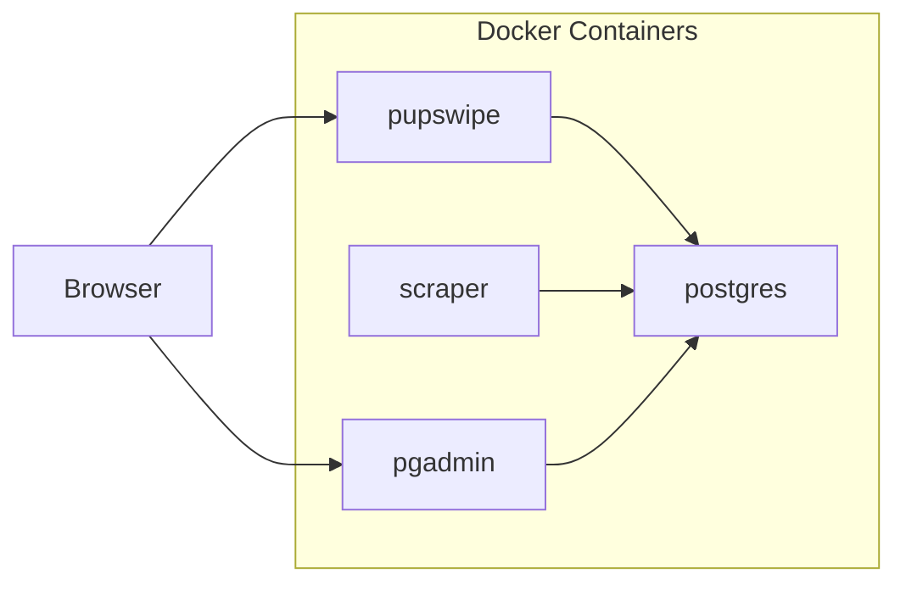
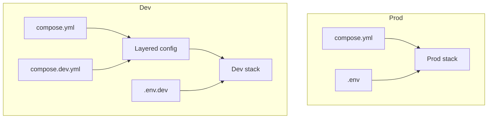

# PuppyPing

PuppyPing scrapes adoptable puppy profiles, stores them in Postgres, and serves a swipe UI (`PupSwipe`) for browsing and recording likes/nope actions.

This repo is a combination of coding + vibe coding.

Current behavior:
- Scraper sources: `paws_chicago` and `wright_way`
- PupSwipe feed: currently filtered to `paws_chicago` only
- Swipe mapping: `right = Like`, `left = Nope`

## Environment Modes

`compose.yml` is the production baseline.

`compose.dev.yml` is a development override layered on top of `compose.yml`.

### Production vs Development

- Prod (`compose.yml`):
  - `pupswipe` default bind: `0.0.0.0:8000`
  - Postgres port: `5433`
  - pgAdmin port: `5050`
  - volumes/network names: `puppyping_*`
- Dev (`compose.yml` + `compose.dev.yml`):
  - `pupswipe` default bind: `127.0.0.1:8001`
  - Postgres port: `5434`
  - pgAdmin port: `5051`
  - container names, volumes, and network use `*_dev`
  - source code bind-mounted for live Python edits
  - scraper runs `--once --no-email` by default in dev

## Mermaid Diagrams

### Architecture



### Compose Layering



Compose layering rules:

- Compose processes files in order; later files override earlier files for the same keys.
- Production uses only `compose.yml`.
- Development uses `compose.yml` as base plus `compose.dev.yml` overrides.

## Architecture Notes

- `puppyping-scraper` orchestrates scrape runs, status updates, profile storage, and email dispatch.
- `puppyping-pupswipe` serves the web UI and API, and records swipe events and subscriptions.
- `puppyping-postgres` is the shared system of record for scraped profiles, link status, swipes, and subscribers.
- `puppyping-pgadmin` is an admin UI for inspecting and managing the Postgres database.

The scraper uses composition to support multiple providers without hard-coding provider logic into the runner:

- `puppyping/server.py` iterates `SOURCES` and calls generic provider entry points.
- `puppyping/providers/__init__.py` composes source-specific implementations through `FETCH_LINKS` and `FETCH_PROFILE` registries.
- Each provider module implements the same contracts (`fetch_adoptable_dog_profile_links_*` and `fetch_dog_profile_*`) and is registered once.
- To add another provider, implement the two functions in a new provider module and register it in the two maps; the scraper loop can use it immediately.

## Setup

### 1. Env Files

Create env files from templates:

```powershell
cp .env.prod.example .env
cp .env.dev.example .env.dev
```

### 2. Run Production

```powershell
docker compose --env-file .env -f compose.yml up --build -d
```

### 3. Run Development

```powershell
docker compose --env-file .env.dev -f compose.yml -f compose.dev.yml up --build
```

## Service Access

- Prod PupSwipe: `http://<host-or-domain>:8000` (default)
- Dev PupSwipe: `http://127.0.0.1:8001` (default)
- Prod pgAdmin: `http://localhost:5050`
- Dev pgAdmin: `http://localhost:5051`

## Common Commands

Run a one-shot scrape without sending email:

```powershell
docker compose --env-file .env -f compose.yml run --rm --no-deps -T puppyping python -m puppyping --once --no-email
```

Run tests:

```powershell
python -m pip install -e .[dev]
python -m pytest
```

## PupSwipe API

- `GET /api/puppies?limit=40` returns current feed items.
- `POST /api/swipes` stores swipe events:
  - `swipe: "right"` = like
  - `swipe: "left"` = nope
- `GET /api/health` checks DB connectivity.

Example payload:

```json
{
  "dog_id": 123,
  "swipe": "right",
  "source": "pupswipe"
}
```

## Data Model (Postgres)

- `dog_profiles`: historical scraped snapshots.
- `cached_links`: per-link cache with source + active flags.
- `dog_status`: current active links by source.
- `dog_swipes`: PupSwipe left/right interactions + basic client metadata.
- `email_subscribers`: PuppyPing alert subscriptions.

## Legal Note in App

PupSwipe displays a disclaimer that PuppyPing is not affiliated with any rescue, shelter, breeder, or adoption provider.

## Project Structure

- `puppyping/server.py`: scraper scheduling + persistence + email dispatch.
- `puppyping/providers/`: source-specific scraping logic.
- `puppyping/db.py`: Postgres schema and DB operations.
- `puppyping/pupswipe/server.py`: PupSwipe web server + API.
- `puppyping/models.py`: core dataclasses.
- `tests/`: pytest suite.
