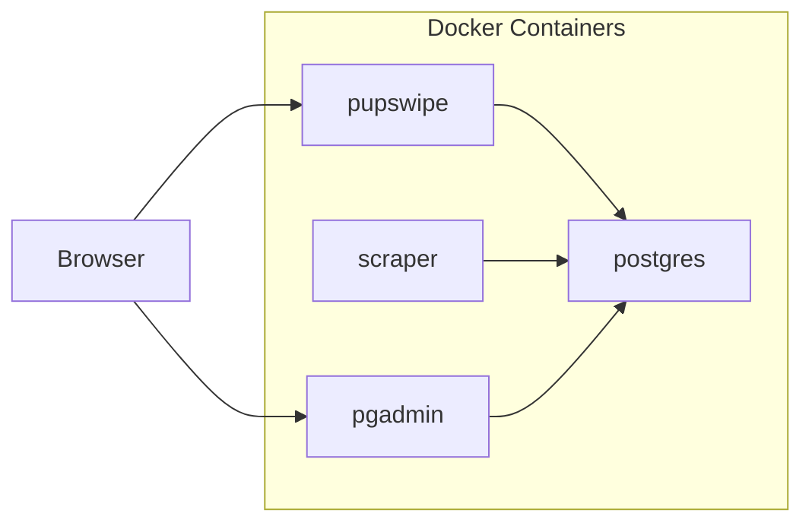
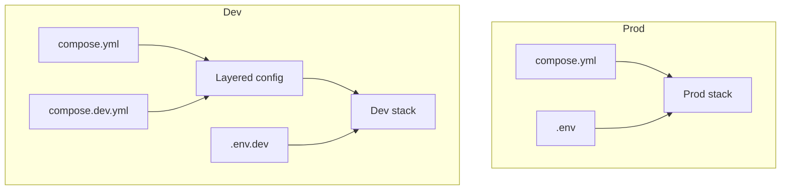

# PuppyPing

PuppyPing scrapes adoptable puppy profiles, stores them in Postgres, and serves a swipe UI (`PupSwipe`) for browsing and recording likes/nope actions.

This repo is a combination of coding + vibe coding.

Current behavior:
- Scraper sources: `paws_chicago` and `wright_way`
- PupSwipe feed: includes `paws_chicago` and `wright_way`
- Swipe mapping: `right = Like`, `left = Nope`
- PupSwipe feed sources can be overridden with `PUPSWIPE_SOURCES` (comma-separated)

## Environment Modes

`compose.yml` is the production baseline.

`compose.dev.yml` is a development override layered on top of `compose.yml`.

### Production vs Development

- Prod (`compose.yml`):
  - `pupswipe` default bind: `0.0.0.0:8000`
  - Postgres port: `5433`
  - pgAdmin port: `5050`
  - volumes/network names: `puppyping_*`
- Dev (`compose.yml` + `compose.dev.yml`):
  - `pupswipe` default bind: `127.0.0.1:8001`
  - Postgres port: `5434`
  - pgAdmin port: `5051`
  - container names, volumes, and network use `*_dev`
  - source code bind-mounted for live Python edits
  - scraper runs `--once --no-email` by default in dev

## Mermaid Diagrams

### Architecture



### Compose Layering



Compose layering rules:

- Compose processes files in order; later files override earlier files for the same keys.
- Production uses only `compose.yml`.
- Development uses `compose.yml` as base plus `compose.dev.yml` overrides.

## Architecture Notes

- `puppyping-scraper` orchestrates scrape runs, status updates, profile storage, and email dispatch.
- Scraper runtime: container runs cron in foreground and schedules scrape jobs at container start and daily at `1:00 PM` (`America/Chicago`).
- `puppyping-pupswipe` serves the web UI and API for swiping, account auth, likes, and password reset flows.
- PupSwipe module split:
  - `puppyping/pupswipe/server.py` handles HTTP routing/controller wiring.
  - `puppyping/pupswipe/config.py` defines constants and source/provider config helpers.
  - `puppyping/pupswipe/auth.py` handles password validation/hashing, session cookie encode/decode, and reset-email utilities.
  - `puppyping/pupswipe/repository.py` handles schema setup and DB read/write operations.
  - `puppyping/pupswipe/pages.py` handles server-rendered HTML output.
- `puppyping-postgres` is the shared system of record for scraped profiles, link status, swipes, and subscribers.
- `puppyping-pgadmin` is an admin UI for inspecting and managing the Postgres database.

The scraper uses composition to support multiple providers without hard-coding provider logic into the runner:

- `puppyping/server.py` iterates `SOURCES` and calls generic provider entry points.
- `puppyping/providers/__init__.py` composes source-specific implementations through `FETCH_PET_LINKS` and `FETCH_PET_PROFILE` registries.
- Each provider module implements the same contracts (`fetch_adoptable_pet_profile_links_*` and `fetch_pet_profile_*`) and is registered once.
- To add another provider, implement the two functions in a new provider module and register it in the two maps; the scraper loop can use it immediately.

## Setup

### 1. Env Files

Create env files from templates:

```powershell
cp .env.prod.example .env
cp .env.dev.example .env.dev
```

### 2. Run Production

```powershell
docker compose --env-file .env -f compose.yml up --build -d
```

### 3. Run Development

```powershell
docker compose --env-file .env.dev -f compose.yml -f compose.dev.yml up --build
```

## Service Access

- Prod PupSwipe: `http://<host-or-domain>:8000` (default)
- Dev PupSwipe: `http://127.0.0.1:8001` (default)
- Prod pgAdmin: `http://localhost:5050`
- Dev pgAdmin: `http://localhost:5051`

## Common Commands

Run a one-shot scrape without sending email:

```powershell
docker compose --env-file .env -f compose.yml run --rm --no-deps -T puppyping python -m puppyping --once --no-email
```

Run tests:

```powershell
python -m pip install -e .[dev]
python -m pytest
```

## Scraper Scheduling (Server)

Production scheduling is internal to the `puppyping` container via cron:

- cron file: `docker/puppyping.cron`
- run target: `docker/run_scrape_cron.sh`
- schedule:
  - `@reboot` (runs when container starts)
  - `0 13 * * *` (`1:00 PM`, `America/Chicago`)

No host-level cron entry is required for scraper runs.

After changing cron or scraper runtime files, rebuild/restart the scraper service:

```bash
docker compose --env-file .env -f compose.yml up -d --build puppyping
```

Inspect cron-driven scraper logs:

```bash
docker logs puppyping-scraper
```

Force an immediate manual run inside the running scraper container:

```bash
docker exec puppyping-scraper /app/docker/run_scrape_cron.sh
```

## Daily Postgres Backup

Backup script (checked into this repo):

- `scripts/backup_postgres.sh`

It creates compressed logical dumps under:

- `/mnt/thebutler/data/puppyping/postgres/backups`

Install on server:

```bash
sudo install -m 700 scripts/backup_postgres.sh /usr/local/bin/puppyping_pg_backup.sh
```

Run once manually:

```bash
/usr/local/bin/puppyping_pg_backup.sh
```

Schedule daily backup at 1:30 AM with 30-day retention:

```bash
(crontab -l 2>/dev/null; echo '30 1 * * * /usr/local/bin/puppyping_pg_backup.sh >> /var/log/puppyping_pg_backup.log 2>&1') | crontab -
```

## PupSwipe API

- `GET /api/puppies?limit=40` returns current feed items.
- `POST /api/swipes` stores swipe events:
  - `swipe: "right"` = like
  - `swipe: "left"` = nope
- `GET /api/health` checks DB connectivity.
- `GET /signin` renders email + password sign-in; the first successful sign-in creates the account and later sign-ins authenticate it.
- `GET /likes` shows session-scoped liked puppies for the signed-in user.
- `GET /reset-password` runs the signed-in user password change flow.
- `GET /forgot-password` requests an email reset link.
- `GET /forgot-password/reset?token=...` renders token-based password reset (email-delivered, one-time token, expiry enforced).
- Forgot-password emails rely on SMTP env vars and `PUPSWIPE_PUBLIC_URL` for reset-link generation to the public host.

Example payload:

```json
{
  "dog_id": 123,
  "swipe": "right",
  "source": "pupswipe"
}
```

## Data Model (Postgres)

- `dog_profiles`: historical scraped snapshots.
- `cached_links`: per-link cache with source + active flags.
- `dog_status`: current active links by source.
- `dog_swipes`: PupSwipe left/right interactions with optional `user_id` plus client metadata.
- `users`: signed-in PupSwipe users keyed by unique `email`.
- `dog_likes`: per-user liked dogs with uniqueness on (`user_id`, `dog_id`).
- `password_reset_tokens`: hashed one-time tokens with `expires_at_utc` and `used_at_utc`.
- `email_subscribers`: PuppyPing alert subscriptions.

## Legal Note in App

PupSwipe displays a disclaimer that PuppyPing is not affiliated with any rescue, shelter, breeder, or adoption provider.

## Project Structure

- `puppyping/server.py`: single scrape cycle + persistence + email dispatch.
- `puppyping/providers/`: source-specific scraping logic.
- `puppyping/db.py`: Postgres schema and DB operations.
- `puppyping/pupswipe/server.py`: PupSwipe HTTP routes and request orchestration.
- `puppyping/pupswipe/config.py`: PupSwipe constants and source/provider config helpers.
- `puppyping/pupswipe/auth.py`: PupSwipe auth/session/password-reset utilities.
- `puppyping/pupswipe/repository.py`: PupSwipe schema + data access layer.
- `puppyping/pupswipe/pages.py`: PupSwipe server-rendered page templates.
- `puppyping/models.py`: core dataclasses.
- `docker/puppyping.cron`: production cron schedule for scraper runs.
- `docker/run_scrape_cron.sh`: cron task runner that executes one scrape cycle.
- `scripts/backup_postgres.sh`: daily Postgres backup helper.
- `tests/`: pytest suite.
