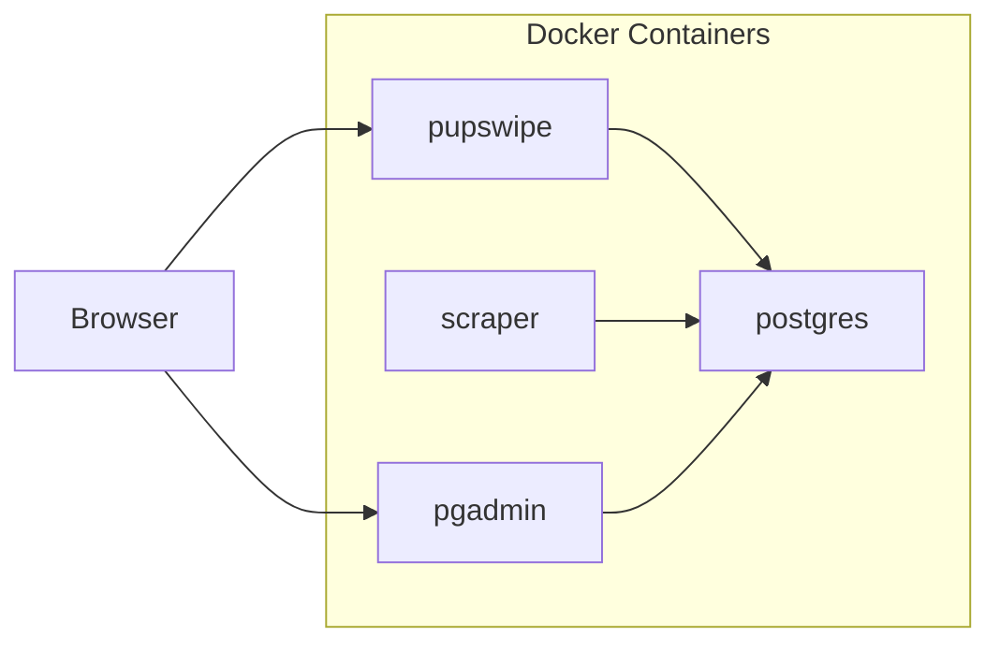
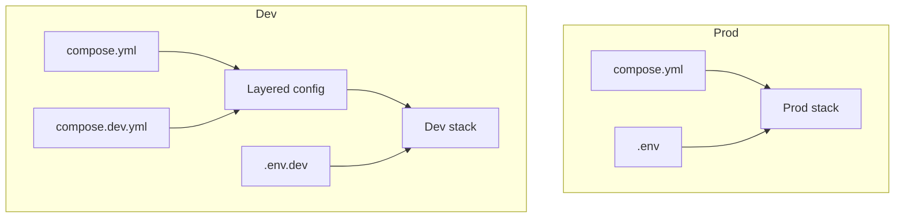

# Architecture

## Container Layout

## Compose Layering

## Scraper Design

- `puppyping/server.py` drives scrape cycles, persistence, and email dispatch.
- Provider logic is registered in `puppyping/providers/__init__.py`.
- Each provider implements the same contracts:
  - `fetch_adoptable_pet_profile_links_*`
  - `fetch_pet_profile_*`
- `puppyping/db.py` owns schema and data persistence for scraped profiles/status.

## PupSwipe Design

`puppyping/pupswipe/` is split into focused modules:

- `server.py`: HTTP routes and request orchestration
- `config.py`: constants and source/provider config helpers
- `auth.py`: password/session/reset helpers
- `repository.py`: schema setup + DB access for PupSwipe
- `pages.py`: server-rendered HTML
