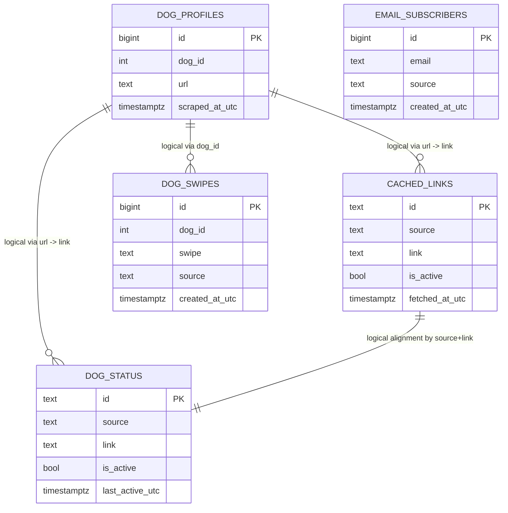

# Database Schema

This document describes the current Postgres schema created by:

- `puppyping/db.py` via `ensure_schema(...)`
- `puppyping/pupswipe/server.py` via `_ensure_app_schema(...)`

## Tables

### `dog_profiles`

Historical snapshot table for scraped dog profiles.

| Column | Type | Null | Default | Notes |
|---|---|---|---|---|
| `id` | `BIGSERIAL` | No | auto | Primary key |
| `dog_id` | `INTEGER` | No | - | Source dog identifier |
| `url` | `TEXT` | No | - | Profile URL |
| `name` | `TEXT` | Yes | `NULL` | Parsed dog name |
| `breed` | `TEXT` | Yes | `NULL` | Parsed breed |
| `gender` | `TEXT` | Yes | `NULL` | Parsed gender |
| `age_raw` | `TEXT` | Yes | `NULL` | Raw age string |
| `age_months` | `NUMERIC` | Yes | `NULL` | Parsed numeric age |
| `weight_lbs` | `NUMERIC` | Yes | `NULL` | Parsed numeric weight |
| `location` | `TEXT` | Yes | `NULL` | Source location |
| `status` | `TEXT` | Yes | `NULL` | Source status text |
| `ratings` | `JSONB` | Yes | `NULL` | Provider-specific rating fields |
| `description` | `TEXT` | Yes | `NULL` | Long description |
| `media` | `JSONB` | Yes | `NULL` | Media payload (images/videos/embeds) |
| `scraped_at_utc` | `TIMESTAMPTZ` | No | - | Snapshot timestamp |

Constraints and indexes:

- Primary key: `dog_profiles_pkey (id)`
- Unique: `(dog_id, scraped_at_utc)`
- Index: `idx_dog_profiles_scraped_at (scraped_at_utc DESC)`

### `cached_links`

Per-source cached profile links and freshness state.

| Column | Type | Null | Default | Notes |
|---|---|---|---|---|
| `id` | `TEXT` | No | - | Primary key, md5 hash of `link` |
| `source` | `TEXT` | No | `'unknown'` | Provider/source name |
| `link` | `TEXT` | No | - | Profile URL |
| `fetched_at_utc` | `TIMESTAMPTZ` | No | - | Fetch timestamp |
| `is_active` | `BOOLEAN` | No | `FALSE` | Active in current batch for source |
| `last_active_utc` | `TIMESTAMPTZ` | Yes | `NULL` | Last time observed active |

Constraints and indexes:

- Primary key: `cached_links_pkey (id)`
- Unique index: `idx_cached_links_link (link)`
- Index: `idx_cached_links_fetched_at (fetched_at_utc DESC)`
- Index: `idx_cached_links_source_active (source, is_active)`

Migration notes handled by `ensure_schema(...)`:

- Converts legacy `links` array-based schema into one-row-per-link form.
- Converts non-text `id` variants to text hash IDs.

### `email_subscribers`

Email subscriptions for PuppyPing notifications.

| Column | Type | Null | Default | Notes |
|---|---|---|---|---|
| `id` | `BIGSERIAL` | No | auto | Primary key |
| `email` | `TEXT` | No | - | Normalized email value |
| `source` | `TEXT` | No | `'unknown'` | Subscription source (for example `pupswipe`) |
| `created_at_utc` | `TIMESTAMPTZ` | No | - | Subscription creation timestamp |

Constraints and indexes:

- Primary key: `email_subscribers_pkey (id)`
- Unique index: `idx_email_subscribers_email_lower (LOWER(email))`
- Index: `idx_email_subscribers_created_at (created_at_utc DESC)`

### `dog_status`

Current active/inactive status of links by source.

| Column | Type | Null | Default | Notes |
|---|---|---|---|---|
| `id` | `TEXT` | No | - | Primary key, md5 hash of `source:link` |
| `source` | `TEXT` | No | - | Provider/source name |
| `link` | `TEXT` | No | - | Profile URL |
| `is_active` | `BOOLEAN` | No | `FALSE` | Active in current batch for source |
| `last_active_utc` | `TIMESTAMPTZ` | Yes | `NULL` | Last observed active timestamp |

Constraints and indexes:

- Primary key: `dog_status_pkey (id)`
- Unique index: `idx_dog_status_source_link (source, link)`
- Index: `idx_dog_status_source_active (source, is_active)`

### `dog_swipes`

PupSwipe interaction events and lightweight client metadata.

| Column | Type | Null | Default | Notes |
|---|---|---|---|---|
| `id` | `BIGSERIAL` | No | auto | Primary key |
| `dog_id` | `INTEGER` | No | - | Dog identifier tied to swipe |
| `swipe` | `TEXT` | No | - | Constrained to `left` or `right` |
| `source` | `TEXT` | Yes | `NULL` | Event source (usually `pupswipe`) |
| `created_at_utc` | `TIMESTAMPTZ` | No | - | Event timestamp |
| `user_key` | `TEXT` | Yes | `NULL` | Derived fingerprint key |
| `user_ip` | `TEXT` | Yes | `NULL` | Client IP |
| `user_agent` | `TEXT` | Yes | `NULL` | Client user agent |
| `accept_language` | `TEXT` | Yes | `NULL` | Client language header |
| `screen_info` | `JSONB` | Yes | `NULL` | Client hint / viewport metadata |

Constraints and indexes:

- Primary key: `dog_swipes_pkey (id)`
- Check constraint: `swipe IN ('left', 'right')`
- Index: `idx_dog_swipes_created_at (created_at_utc DESC)`
- Index: `idx_dog_swipes_dog_id (dog_id)`
- Index: `idx_dog_swipes_user_key (user_key)`

## Relationships

The schema does not enforce foreign keys between tables. Logical relationships are:

- `dog_swipes.dog_id` -> latest `dog_profiles.dog_id` rows
- `cached_links.link` and `dog_status.link` -> `dog_profiles.url`
- `dog_status.source` and `cached_links.source` align with provider names (for example `paws_chicago`, `wright_way`)

## ERD

The ERD below shows logical relationships used by the application.
These relationships are not enforced by database foreign key constraints.

